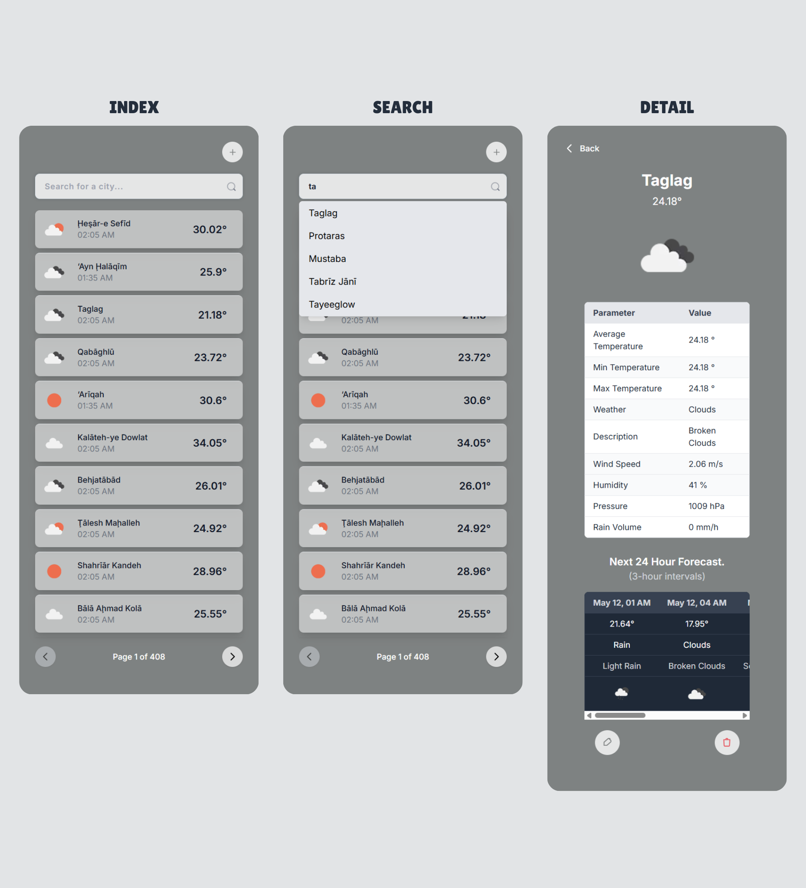

# 🌤️ Weather App



## 🚀 Setup Instructions

1. **Copy and configure environment variables:**
- Duplicate the `.env.example` file and rename it to `.env`
- Get your **OpenWeather API key** from [openweathermap.org](https://openweathermap.org/api)
- Add the API key to the `.env` file


2. **Install dependencies:**
```shell
# Install dependencies
$ npm install
# or
$ yarn install
```


3. **Run the development server:**
```shell
# Start dev server with hot reload at localhost:3000
$ npm run dev 
# or 
$ yarn run dev
```


4. **Open in your browser:**
- Visit http://localhost:3000 to view the app.
